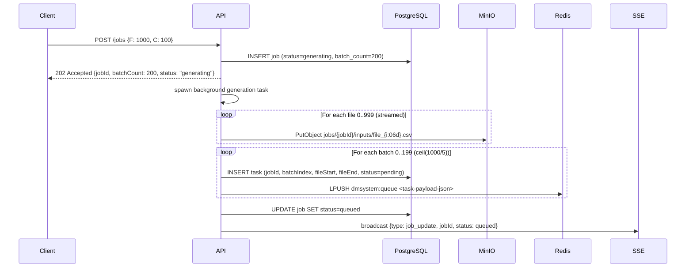
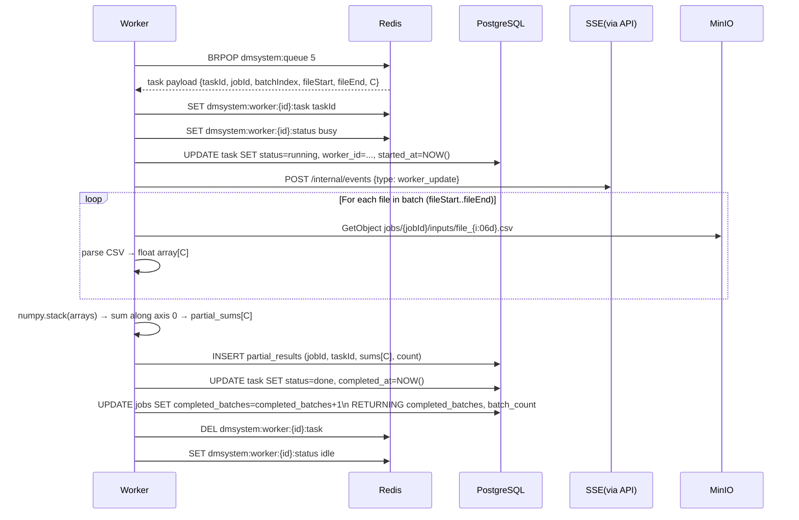
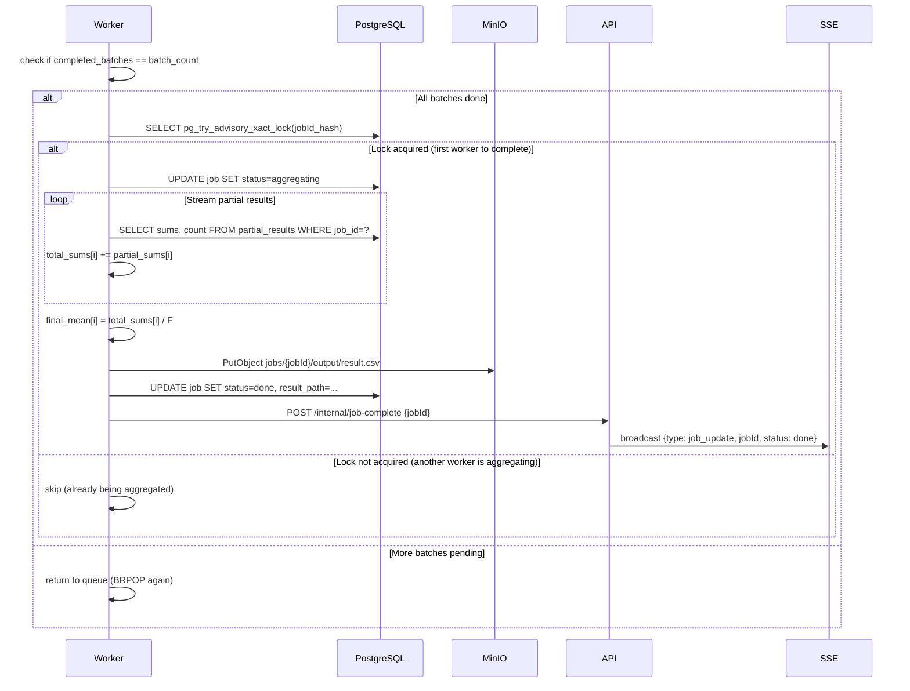
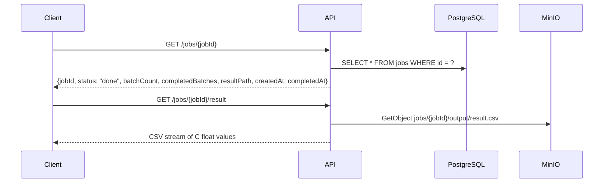

# DESIGN-001: End-to-End Job Lifecycle

## Overview
This document describes the complete flow from job creation through worker processing to final result delivery. It covers the data flow, component interactions, and state transitions for a single job.

## Components Involved
- **Client** — Browser UI or API consumer
- **API** (Node.js/Express/TypeScript) — Job management, file generation, task enqueueing
- **PostgreSQL** — Persistent store for jobs, tasks, partial results
- **Redis** — Task queue (LIST), worker registry (SET + STRING keys)
- **MinIO** — Object storage for input files and output result
- **Worker** (Python) — Task processing (file download, computation, partial result storage)

## Data Flow

### Phase 1: Job Creation



### Phase 2: Worker Processing



### Phase 3: Completion Detection & Aggregation



### Phase 4: Result Retrieval



## Key Contracts

### Task Queue Message Schema
```typescript
interface TaskMessage {
  taskId: string;        // UUID
  jobId: string;         // UUID
  batchIndex: number;    // 0-based batch number
  fileStart: number;     // first file index (inclusive)
  fileEnd: number;       // last file index (inclusive)
  c: number;             // number of values per file
}
```

### Partial Result Schema (PostgreSQL)
```sql
partial_results(
  id        UUID PRIMARY KEY,
  job_id    UUID REFERENCES jobs(id),
  task_id   UUID REFERENCES tasks(id),
  sums      FLOAT8[],   -- length C, partial sums for each index
  count     INTEGER,    -- number of files in this batch
  created_at TIMESTAMPTZ
)
```

### Worker Redis Keys
```
dmsystem:queue              LIST  — task payloads (FIFO, BRPOP)
dmsystem:dlq                LIST  — dead-letter tasks
dmsystem:workers            SET   — active worker IDs
dmsystem:worker:{id}:status STRING — "idle" | "busy"
dmsystem:worker:{id}:hb     STRING — heartbeat (TTL=15s)
dmsystem:worker:{id}:task   STRING — current task ID (if busy)
```

## State Machine: Job

```
GENERATING → QUEUED → RUNNING → AGGREGATING → DONE
                               ↘             ↗
                                   FAILED
```

- `GENERATING`: API is creating files in MinIO
- `QUEUED`: All files created, all tasks in Redis queue
- `RUNNING`: At least one task is in-progress (workers processing)
- `AGGREGATING`: All batches complete, combining partial results
- `DONE`: result.csv written, job complete
- `FAILED`: Unrecoverable error in any stage

## Open Questions
| Question | Owner | Notes |
|----------|-------|-------|
| File generation timeout for F=100k | API team | Async background; job status shows 'generating' |
| Partial result cleanup after job done | Ops | Keep for audit? Or delete to save space? |
| Worker scale-down: graceful drain | Infra | Worker checks shutdown signal after each task |
