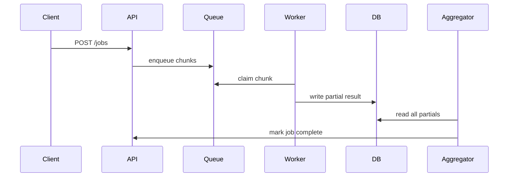

# Design Documents

High-level design docs that describe HOW the system works — data flows, component interactions, sequence diagrams.

## Naming
`DESIGN-NNN-short-slug.md`  e.g. `DESIGN-001-job-lifecycle.md`

## Template

```markdown
# DESIGN-NNN: Title

## Overview
One-paragraph summary of what this doc covers.

## Components Involved
List the modules/services this design touches.

## Data Flow
Step-by-step narrative or sequence diagram (Mermaid preferred).



## Key Contracts
Interfaces/schemas that components must honour.

## Open Questions
Unresolved design questions with owner and deadline.
```

## Index

| # | Title |
|---|-------|
| [DESIGN-001](DESIGN-001-job-lifecycle.md) | End-to-end job lifecycle |
| [DESIGN-002](DESIGN-002-worker-dispatch.md) | Worker dispatch and work stealing |
| [DESIGN-003](DESIGN-003-aggregation.md) | Partial result aggregation |
| [DESIGN-004](DESIGN-004-ui-realtime.md) | UI real-time data flow |
